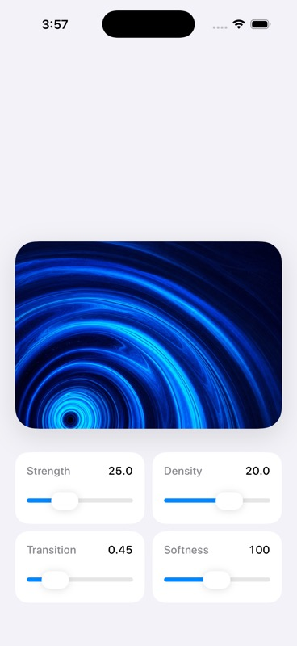

# Ripple Image Transitions

SwiftUI + Metal sample for one atomic ripple + image reveal transition.

> This is an evaluation fork of
> [`eujinco/ripple-image-transitions`](https://github.com/eujinco/ripple-image-transitions).
> It preserves the upstream implementation and attribution while demonstrating a
> read-only [memi](https://github.com/sarveshsea/memi) design-audit integration.
> The fork is not affiliated with or endorsed by the upstream maintainer.

Each tap:

- captures a single origin point
- starts the ripple from that point
- starts the reveal from the same point
- ignores additional taps until the current transition finishes
- commits the next image only after the reveal duration has elapsed

[Watch the demo on X by @eujinco](https://x.com/eujinco/status/2050865443272089819?s=20)

## Read-only memi audit

The repository pins both the memi action source and CLI version. The workflow
does not edit tracked source files:

```bash
DO_NOT_TRACK=1 MEMI_TELEMETRY_DISABLED=1 \
  npx -y @memi-design/cli@2.6.2 \
  diagnose . --json --no-write --fail-on none
```

The current CLI is primarily a web UI scanner. On this SwiftUI project it
reports zero scanned files, so its nominal score is not treated as evidence of
interface quality. See the
[baseline report](./docs/memi-design-audit.md) for the exact result and the
manual SwiftUI/Metal findings that remain outside the scanner's coverage.

The checked-in [`memoire.agent.yaml`](./memoire.agent.yaml) narrows the
integration to a read-only SwiftUI audit recipe. CI uploads memi's generated
health artifacts without committing them.



The screenshot was captured after a clean Debug build and launch on the
`Nate Design QA 26.5` iPhone simulator. It is launch evidence, not a substitute
for accessibility or interaction testing.

## Repository Boundary

This repository is a reference sample, not a general-purpose SDK.

It is intentionally scoped to:

- one atomic ripple + reveal interaction
- one small demo feature shell
- one clearly defined feature owner in `RipplePreviewModel`

It is intentionally not trying to provide:

- a reusable animation package
- a reusable public API surface
- a general-purpose app architecture template
- a service layer or coordinator hierarchy

## Docs

- [Documentation Index](./docs/README.md)
- [Getting Started](./docs/getting-started.md)
- [Architecture](./docs/architecture.md)
- [Project Structure](./docs/project-structure.md)
- [Customization Notes](./docs/customization.md)

## Signing

- the sample uses the neutral bundle identifier `com.example.ripple`
- simulator runs can use the project as-is
- if you run on a physical device, set your own Apple development team and replace the bundle identifier with one that is unique to your account

## Sample Media Notice

- the upstream Apple-derived sample media was removed from this fork
- the replacement abstract demo images were generated specifically for this
  fork and are offered under this repository's MIT license on the contractual
  basis documented in the provenance record
- see [media rights](./docs/media-rights.md) and the machine-readable
  [provenance record](./docs/media/provenance.json)

## License

[MIT License](./LICENSE), preserving copyright and attribution to Eujin Nam.
