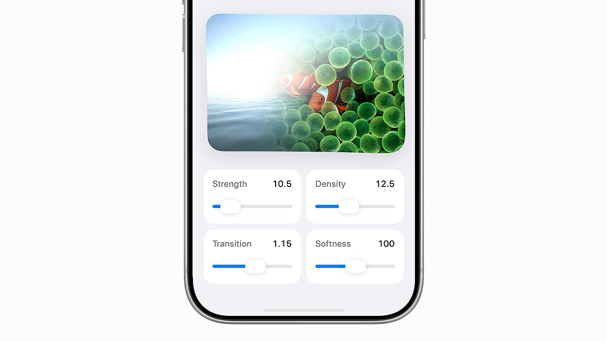

# Ripple Image Transitions

SwiftUI + Metal sample for one atomic ripple + image reveal transition.

Each tap:

- captures a single origin point
- starts the ripple from that point
- starts the reveal from the same point
- ignores additional taps until the current transition finishes
- commits the next image only after the reveal duration has elapsed

[Watch the demo on X by @eujinco](https://x.com/eujinco/status/2050865443272089819?s=20)

## Repository Boundary

This repository is a reference sample, not a general-purpose SDK.

It is intentionally scoped to:

- one atomic ripple + reveal interaction
- one small demo feature shell
- one clearly defined feature owner in `RipplePreviewModel`

It is intentionally not trying to provide:

- a reusable animation package
- a reusable public API surface
- a general-purpose app architecture template
- a service layer or coordinator hierarchy

## Docs

- [Documentation Index](./docs/README.md)
- [Getting Started](./docs/getting-started.md)
- [Architecture](./docs/architecture.md)
- [Project Structure](./docs/project-structure.md)
- [Customization Notes](./docs/customization.md)

## Signing

- the sample uses the neutral bundle identifier `com.example.ripple`
- simulator runs can use the project as-is
- if you run on a physical device, set your own Apple development team and replace the bundle identifier with one that is unique to your account

## Sample Media Notice

- bundled sample media is not covered by the repository MIT license
- commercial use of the sample media is not allowed; see [docs/media-rights.md](./docs/media-rights.md)

## License

[MIT License](./LICENSE)
