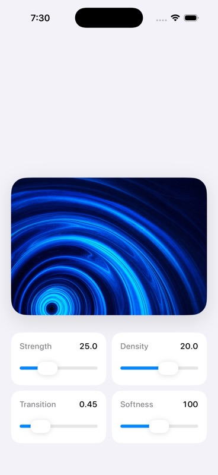
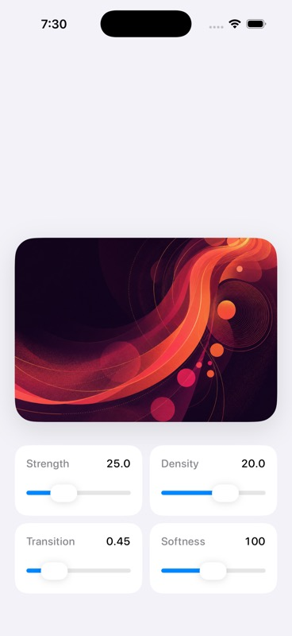

# Read-only memi design-audit baseline and rendered rerun

- Date: 2026-07-26
- Repository: `sarveshsea/ripple-image-transitions`
- Upstream: `eujinco/ripple-image-transitions`
- CLI: `@memi-design/cli@2.6.2`
- Action source: `sarveshsea/memi@ee3f3f00731a7a08c7616d4dfb14440165a86354`

## Method

The baseline was collected without allowing memi to write project files:

```bash
DO_NOT_TRACK=1 MEMI_TELEMETRY_DISABLED=1 \
  npx -y @memi-design/cli@2.6.2 \
  diagnose . --json --no-write --fail-on none
```

CI uses the same exact CLI version through a full-commit action pin. Generated
CI reports exist only in the runner workspace and uploaded artifact.

## Simulator evidence

The unchanged SwiftUI and Metal implementation plus replacement assets built
and launched successfully in Debug configuration on the `Nate Design QA 26.5`
iPhone simulator:

- XcodeBuildMCP build-and-run status: succeeded
- XcodeBuildMCP structured diagnostics: 0 warnings and 0 errors
- independent generic `xcodebuild`: succeeded, with one
  `appintentsmetadataprocessor` warning that metadata extraction was skipped
  because the app has no `AppIntents.framework` dependency
- bundle identifier: `com.example.ripple`
- visual evidence: [`media/memi-simulator-proof.jpg`](./media/memi-simulator-proof.jpg)

That historical screenshot proves launch and rendering only. A later candidate
rerun adds runtime accessibility and reduced-motion evidence below.

## Result and coverage

| Evidence | Result |
| --- | --- |
| Exit status | Passed with `fail-on none` |
| Reported score | 98, nominal only |
| Scanned files | 0 |
| Routes/components/styles | 0 / 0 / 0 |
| High-severity finding | `scan.empty`: no Tailwind or HTML class usage |
| Valid SwiftUI quality conclusion | None |

The reported 98 is not accepted as evidence of design quality. The scanner
assessed no Swift files and several UX dimensions were marked protected despite
having no rendered or behavioral evidence. This baseline therefore proves only
that the read-only integration runs; it also identifies SwiftUI coverage as the
primary Memi product gap.

## Manual SwiftUI and Metal review

Manual findings are kept separate from the Memi score:

1. **High: no reduced-motion path.** The tap always drives keyframe and shader
   animation. The sample should use `accessibilityReduceMotion` to provide an
   immediate or low-motion reveal.
2. **Medium: the image canvas is gesture-only.** `onSpatialTap` has no explicit
   accessibility action, label, or hint for assistive technologies.
3. **Medium: performance is reasoned about but not measured.** The shader caps
   sample offset and pre-decodes images, but there is no named-device frame-time
   or hitch evidence.
4. **Pass: shader math guards zero-distance, speed, amplitude, duration, and
   feather denominators.**
5. **Pass: transition ownership is bounded.** The preview model owns the atomic
   transition and ignores re-entry until completion.

These findings are observations for evaluation, not changes to the upstream
sample.

## Candidate correction and rerun

The fork correction is deliberately small:

- each motion owner reads the system `accessibilityReduceMotion` value
- reduced-motion events have zero duration and do not trigger the ripple shader
- the canvas exposes a label, value, hint, and default accessibility action
- the default action advances from the center of the rendered canvas

The same read-only command was rerun from Memi candidate commit
`b02e150c623e495ba1cf8400b07587eadb5d39c1` against clean detached worktrees:

| Evidence | Before | After |
| --- | --- | --- |
| Fork commit | `96259084962e8e623cbb12fa0c6825600210c4dc` | `22df4797e8b0d87cb5a64a81c933b7c4d7445890` |
| Scanned files | 16 | 16 |
| SwiftUI files | 9 | 9 |
| File-anchored findings | 2 | 0 |
| Gating issues | 2 | 0 |
| Score | 0, partial coverage cap | 0, partial coverage cap |
| Worktree writes | none | none |

The zero after-state findings apply only to
`swiftui.gesture-accessibility-action` and `swiftui.reduced-motion`. Memi
continues to mark whole-category SwiftUI quality, runtime accessibility, Metal
shader semantics, GPU performance, and color correctness as unassessed. The
machine-readable command, commits, hashes, dimensions, and limitations are in
[`memi-rerun-evidence.json`](./memi-rerun-evidence.json).

## Rendered accessibility evidence

The corrected commit built and launched on the `Nate Design QA 26.5` iOS 26.5
simulator with zero build warnings and zero errors. With the simulator's system
Reduce Motion preference enabled:

- the runtime tree exposed `Ripple image preview, Image 1 of 2` as a button
- its default action advanced to `Ripple image preview, Image 2 of 2`
- the transition used the static branch while both animator triggers were
  disabled by the same environment value

| Before action | After action |
| --- | --- |
|  |  |

## Licensing evidence

The upstream MIT license and Eujin Nam copyright notice are preserved. The
three Apple-derived media files excluded by upstream were removed or replaced
before publication. Replacement provenance is documented in
[`media-rights.md`](./media-rights.md) and the machine-readable
[`media/provenance.json`](./media/provenance.json).

## Remaining acceptance boundary

This proof closes the two assessed static findings and supplies their rendered
rerun. It does not justify a broad native-quality score. Memi still needs to:

- expand beyond the current partial SwiftUI checks
- assess Metal shader semantics and color correctness
- measure GPU frame time and hitches on named hardware
- ingest durable runtime evidence rather than relying on external evidence
  records
